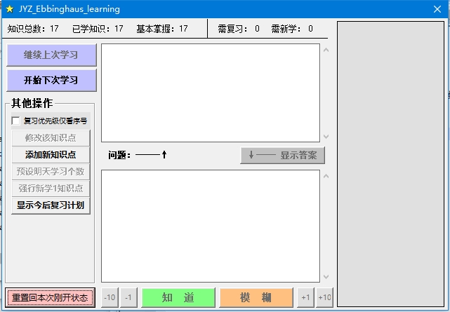

# 艾宾浩斯知识点学习软件

## 如何使用

- 双击 “JYZ_Ebbinghaus_learning_app.exe” 即可打开软件。可进行学习、添加知识点、规划等操作。

## 知识点存储位置

- "Data/data_txt_group/"
- 文件将按序号0~9循环保存，即拥有多个备份，可以在进行情况下保住知识点。
- 文件中按行记录“校验位，问题，答案，问题等级，问题下回学习剩余天数”

## 软件特色

- 当天未学习完时，软件会保存进度，只要在当天之内打开，都能继续学习。
- 当多日未学习时，软件能够具有较高自由度的自定义复习（在软件中非第一次学习时称“复习”）个数与强行新学（在软件中第一次学习时称“新学”）个数。
- 自定义复习个数小于计划复习个数时，不是呆板的按序号顺序，而是根据“问题等级，问题下回学习剩余天数”计算优先级来决定复习哪一部分。
- 进度条可以自定义图片，保持好心情。

## 如何修改源码

- 用VB6编译器打开即可修改。

## 更新记录

- 2024-04上传

## 上传前的更新记录

2019之前未记录

2019-04-30:
1、添加在软件内修改明天学习个数的功能
2、为“重置...”按钮添加一步确认
3、修改排版样式

2019-05-01:
  1、修正了“修改明天学习个数”消息框按取消或叉导致的BUG
  2、修改了程序关闭时的提示框内容的触发方式，新增了提示内容

2019-05-05:
1、为了控制新学个数的上限。修改了“进入下次学习”按键事件中的知识点个数的确认，现在不只是当复习个数超过学习总数时进行知识点个数的确认，而是每次都会进行确认。

2019-09-05:
1、修正了在txt中直接添加新知识点会导致的bug（如果插入的地方上下均为已学知识点，则改新知识点后方的所有知识点都将重新学过），顺便精简了“添加新知识点到当天学习”程序段（原来写的程序相当垃圾）。
2、添加了一些程序注释。

2020-01-05~09的21点:
1、为了防止添加新知识点时，忘点“添加”而直接关闭，导致没能成功添加。完善了程序。
2、微调了等级天数。

2020-01-09的22点:
1、为了解决越先添加的知识点优先级总是越低，但其重要性却普遍较高的矛盾。修改了当“应复习个数”大于“学习总数”时，知识点添加的算法，主要就是剔除中间的知识点，留下头尾。

2020-01-20：
1、将排列靠前的知识点的优先级权重参数化，写入了parameters.txt，变为可调。
2、修改了问题框与答案框间的比例。

2020-03-08:
1、添加了“强行新学知识点”功能。

2020-04-05:
1、完善了各“按键是否可控”状态的调整。
2、修复了按“继续上次”，在按“强行新学”后“需新学”个数显示错误的BUG

2020-04-13:
1、重要更新：新增data_backup.txt文件，有新增知识点时更新。
2、优化了程序结构和某消息框显示格式。

2020-05-01:★★
1、相比4.5，彻底优化了按键使能管理
2、添加了手动改变下回知识点等级的功能 ！！！！！

2020-05-12：
1、添加等级管理个性化功能，主要为政治学习服务

2020-06-02:
1. 修正了学习数为0时可能发生的0除bug

2020-06-07:
1. 添加“记录并显示已经几天没有学新知识点”的功能。

2020-08-28:
1. 使离线存储的知识点数据中的“天数”可以小于0了；方便以后的复习知识点优先级的调整。

2020-09-04：
1、以小于0的剩余天数为优先级，优化了复习知识点的选取

2020-10-10：
1、添加了限制某一个知识点最高等级的功能。在答案文本中写入一串特殊字符，可以限制该知识点的最高等级

2020-10-26：
1、优化了复习过多时第一优先级计算，改为“(下次复习剩余天数-1) / 知识点等级”。
     此举进一步降低了等级较高的知识点的优先级。

2020-11-22:
1、复习天数会选择下回等级附近知识点最少的一个位置进行选择，均衡每天学习个数。

2020-12-29：
1、将复习知识点（已被选中的）的显示顺序打乱了，削减排位靠前的知识点的某些优势。

2021-4-11：
1、添加了一个选项，选择后优先级又不看“(下次复习剩余天数-1) / 知识点等级”，只看序号前后。用于长时间不学习后重新开始学习时，想要从前往后复习时。

2022-01-08：
优化了右侧图片的选取策略，现在添加新图片只需要往文件夹中加就行了。

2024-04：（安全性改动）
1、在data.txt每条问题前添加校验内容，发现校验错误时会提示，防止误操作摧毁积累的data
2、使用一组data_v2__0.txt~data_v2__9.txt）循环保存最新记录，进一步避免data被破坏。data_backup.txt弃用。

